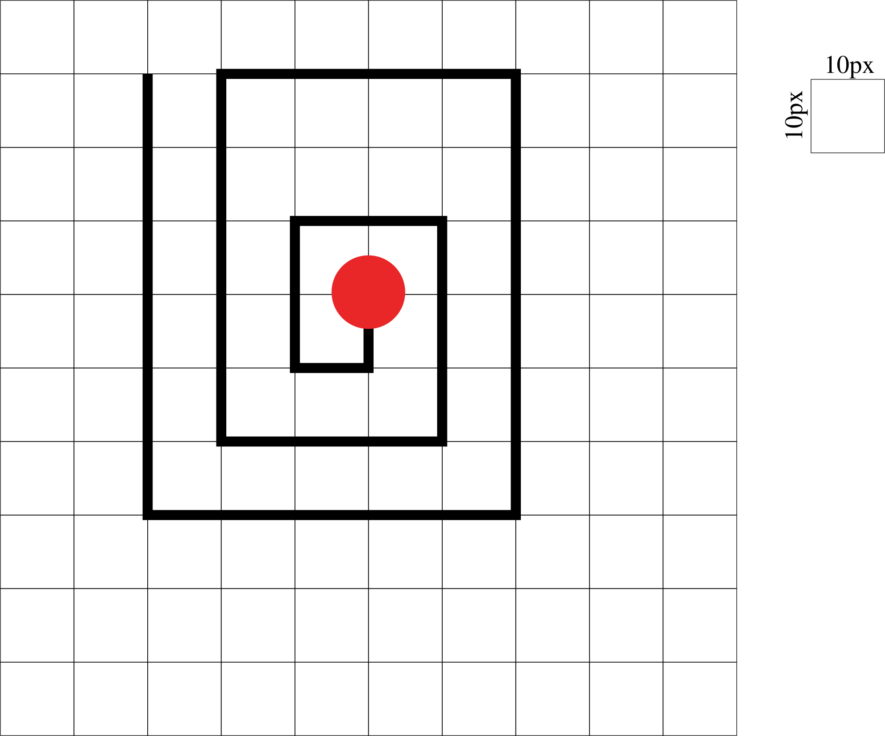

## Installation
* Rentrez dans le dossier *examn* ``cd examen``
* Installez les packages nécessaires et qui sont dans le package.json ```npm install```
* Démarrez le serveur ```npm start```

:rocket: Vous devriez avoir accès à votre serveur local sur [localhost:8080](http:localhost:8080) :rocket:

## Exercice 1 - SVG
Reproduire le dessin suivant dans le navigateur à l’aide des outils que vous avez appris en cours.



## Exercice 2 - Données
Lisez les données countries.geojson et apportez les manipulations suivantes :

1. Filtrez les données qui ont une population plus grandes que 1’000’000 (`POP2005`)
2. Sortez la moyenne de la population par continent¹

¹`REGION` : Europe 150, Afrique 2, Asie 142, Océanie 9, Amériques 19

## Exercice 3 - Visualisations
Avec les données de l’exercice précédent, produisez les visualisations suivantes :

### Carte
* Colorez la carte selon la population des pays
* Rajoutez une info-bulle avec la population du pays quand vous y survolez avec la souris
* Comment appelez-vous ces types de cartes ? Rajoutez la réponse en titre de cette carte
          
### Diagramme en bâtons 
* Diagramme en bâtons  horizontal des valeurs de population par continent
* Rajoutez les deux axes
* Rajoutez une info-bulle avec la population quand on survole sur le continent sélectionné
* Mettre un animation d’entrée 
* Dans l’histogramme, ordonnez les données de la valeur la plus grande à la valeur la plus petite 

## Exercice 4 - Web scraping
A l’aide des outils de webscraping que vous avez appris en cours, allez au lien https://heig-vd.ch/formations/bachelor/filieres et:

* Prenez une capture d’écran de la page
* Ressortez toutes les filières 
* Ressortez le nombre d’orientations par filière

